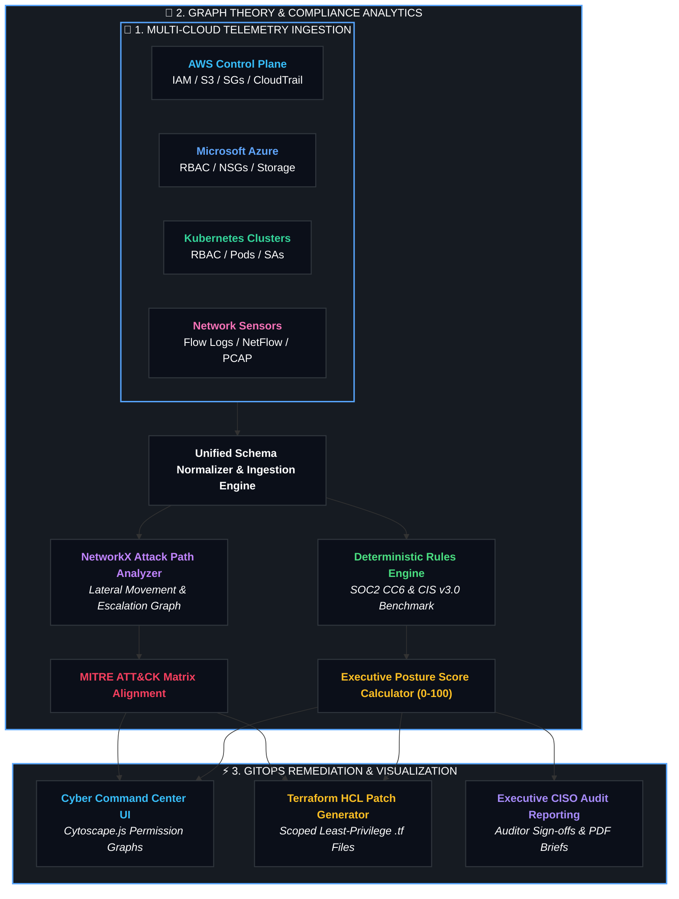

<div align="center">

# 🌐 CYBERSECURITY & NETWORK SECURITY ENGINEERING
### ⚡ *Next-Gen Cloud Security Posture Management • Attack Graph Engine • Zero-Trust Perimeters* ⚡

<br/>

<p align="center">
  
</p>

<!-- Colorful Shield Badges Bar -->
<p align="center">
  <a href="#-core-security-pillars"></a>
  <a href="#-compliance--security-frameworks"></a>
  <a href="#-mitre-attck--threat-matrix"></a>
  <a href="#-zero-trust--cloud-defense-architecture"></a>
  <a href="#-gitops-auto-remediation-engine"></a>
  <a href="#-technologies--tooling-arsenal"></a>
</p>

<br/>

<p align="center">
  <b>A state-of-the-art cybersecurity engineering portfolio and research hub</b> dedicated to autonomous multi-cloud security telemetry, graph-theoretic lateral movement analysis, least-privilege identity governance, micro-segmented zero-trust network architectures, and automated infrastructure-as-code (IaC) defense.
</p>

<p align="center">
  <a href="#-active-security-projects"><b>🚀 Active Projects</b></a> •
  <a href="#-core-security-pillars"><b>🔥 Core Pillars</b></a> •
  <a href="#-zero-trust--cloud-defense-architecture"><b>📐 System Architecture</b></a> •
  <a href="#-live-threat-radar--telemetry-stream"><b>📡 Threat Radar</b></a> •
  <a href="#-mitre-attck--threat-matrix"><b>🎯 MITRE Matrix</b></a> •
  <a href="#-compliance--security-frameworks"><b>📋 Compliance Radars</b></a> •
  <a href="#-technologies--tooling-arsenal"><b>🧰 Tech Arsenal</b></a>
</p>

</div>

---

## 🚀 Active Security Projects

<div align="center">
<table width="100%">
  <tr>
    <td align="left" style="background: linear-gradient(135deg, #0d1117 0%, #161b22 100%); border-radius: 14px; border: 1px solid #30363d; padding: 24px;">
      <div style="display: flex; align-items: center; justify-content: space-between;">
        <h3 style="margin: 0; color: #58a6ff;">
          <a href="audithound/" style="color: #58a6ff; text-decoration: none;">🐺 Project: AuditHound — Autonomous Multi-Cloud Security Posture Engine</a>
        </h3>
        <span>
          <a href="audithound/"></a>
        </span>
      </div>
      <p style="color: #c9d1d9; font-size: 13.5px; line-height: 1.6; margin-top: 10px;">
        An enterprise-grade autonomous Cloud Security Posture Management (CSPM) and attack path visualization platform with <b>Autonomous AI Purple-Teaming Breach Simulation</b>, <b>Temporal Drift Radar</b>, <b>CI/CD GitOps PR Security Sentinel</b>, <b>1-Click Zero-Touch Auto-Remediation</b>, and <b>Real-Time eBPF Runtime Packet Telemetry</b>. Computes deterministic SOC2 & CIS compliance posture scores, traverses privilege escalation graphs with NetworkX, dynamically generates least-privilege Terraform (<code>.tf</code>) patches, and exports auditor-certified CISO reports.
      </p>
      <div style="margin-top: 12px;">
        
        
        
        
        
        
      </div>
      <div style="margin-top: 14px; padding: 10px 14px; background: #0b0f19; border-radius: 8px; border: 1px solid #21262d; font-family: monospace; font-size: 12px; color: #58a6ff;">
        <code>$ cd audithound &amp;&amp; docker compose up --build</code> &nbsp;|&nbsp; <code><a href="audithound/README.md" style="color: #7ee787;">📖 Read AuditHound Documentation →</a></code>
      </div>
    </td>
  </tr>
</table>
</div>

---

## 🔥 Core Security Pillars

<div align="center">
<table width="100%">
  <tr>
    <td width="33%" align="center" style="background: linear-gradient(135deg, #0d1117 0%, #161b22 100%); border-radius: 14px; border: 1px solid #30363d; padding: 22px;">
      
      
      <br/><br/>
      <h3 style="color: #58a6ff; margin: 0;">🛡️ CLOUD SECURITY (CSPM / CIEM)</h3>
      <p align="left" style="font-size: 12px; color: #8b949e; line-height: 1.6;">
        <span style="color: #7ee787;">✔</span> <b>Multi-Cloud Telemetry</b>: AWS IAM, S3, Azure RBAC, NSG drift.<br/>
        <span style="color: #7ee787;">✔</span> <b>Attack Graphs</b>: Directed PassRole & PolicyVersion models.<br/>
        <span style="color: #7ee787;">✔</span> <b>Data Perimeters</b>: Public access blocks & KMS-CMK encryption.<br/>
        <span style="color: #7ee787;">✔</span> <b>Identity Governance</b>: Access key aging & MFA enforcement.
      </p>
    </td>
    <td width="33%" align="center" style="background: linear-gradient(135deg, #0d1117 0%, #161b22 100%); border-radius: 14px; border: 1px solid #30363d; padding: 22px;">
      
      
      <br/><br/>
      <h3 style="color: #bc8cff; margin: 0;">🔒 ZERO-TRUST NETWORK DEFENSE</h3>
      <p align="left" style="font-size: 12px; color: #8b949e; line-height: 1.6;">
        <span style="color: #7ee787;">✔</span> <b>NIST SP 800-207</b>: Strict identity-based perimeter boundaries.<br/>
        <span style="color: #7ee787;">✔</span> <b>Micro-Segmentation</b>: Restricting <code>0.0.0.0/0</code> on SSH/RDP/DBs.<br/>
        <span style="color: #7ee787;">✔</span> <b>Packet Telemetry</b>: Deep flow log inspection & anomaly detection.<br/>
        <span style="color: #7ee787;">✔</span> <b>K8s RBAC Isolation</b>: Revoking default <code>cluster-admin</code> bindings.
      </p>
    </td>
    <td width="33%" align="center" style="background: linear-gradient(135deg, #0d1117 0%, #161b22 100%); border-radius: 14px; border: 1px solid #30363d; padding: 22px;">
      
      
      <br/><br/>
      <h3 style="color: #3fb950; margin: 0;">⚡ GITOPS AUTO-REMEDIATION</h3>
      <p align="left" style="font-size: 12px; color: #8b949e; line-height: 1.6;">
        <span style="color: #7ee787;">✔</span> <b>Terraform Generation</b>: Production-ready <code>.tf</code> least-privilege patches.<br/>
        <span style="color: #7ee787;">✔</span> <b>Policy as Code</b>: Pre-deployment OPA / Rego security gates.<br/>
        <span style="color: #7ee787;">✔</span> <b>CI/CD Security</b>: Automated pre-commit linting & static analysis.<br/>
        <span style="color: #7ee787;">✔</span> <b>Executive Reports</b>: CISO & Lead Auditor signed briefs.
      </p>
    </td>
  </tr>
</table>
</div>

---

## 📐 Zero-Trust & Cloud Defense Architecture

<div align="center">



</div>

---

## 📡 Live Threat Radar & Telemetry Stream

```diff
+ [RADAR ONLINE] Autonomous Security Telemetry Pipeline Active (10 Scenarios Modeled)
! [CRITICAL ALERT] AWS IAM PassRole Escalation detected -> Target: arn:aws:iam::*:role/AdminRole
! [CRITICAL ALERT] S3 Bucket 'ephi-patient-records' Public Read ACL enabled (HIPAA Violation)
! [HIGH RISK]     Kubernetes default namespace ServiceAccount bound to cluster-admin
! [HIGH RISK]     Azure NSG allows 0.0.0.0/0 inbound on MySQL Port 3306 & Postgres Port 5432
+ [REMEDIATION]   6 Automated Terraform (.tf) Least-Privilege Patches Synthesized & Validated
+ [COMPLIANCE]    SOC2 CC6.1, CC6.3, CC6.6 & CIS AWS v3.0 Posture Score Evaluated: 94.0/100 [GRADE A+]
```

<details>
<summary><b>🔍 Click to expand: Automated Terraform Least-Privilege Patch (HCL)</b></summary>

```hcl
# ==============================================================================
# AUDITHOUND AUTONOMOUS REMEDIATION PATCH
# Target Resource: arn:aws:iam::123456789012:user/junior-dev-engineer
# Rule ID        : RULE-AWS-IAM-PRIVESC-PASSROLE-001
# Compliance     : SOC2 CC6.3 (Least Privilege), CIS AWS Foundations v3.0
# ==============================================================================

resource "aws_iam_policy" "remediated_restricted_passrole" {
  name        = "AuditHound_RestrictedPassRole_Scoped"
  description = "Remediated least-privilege PassRole policy scoped to explicit service roles"

  policy = jsonencode({
    Version = "2012-10-17"
    Statement = [
      {
        Sid      = "AllowComputeLifecycle"
        Effect   = "Allow"
        Action   = [
          "ec2:RunInstances",
          "ec2:DescribeInstances",
          "ec2:StopInstances"
        ]
        Resource = "*"
      },
      {
        Sid       = "RestrictedPassRoleToSpecificService"
        Effect    = "Allow"
        Action    = "iam:PassRole"
        Resource  = "arn:aws:iam::123456789012:role/ScopedApplicationRole"
        Condition = {
          StringEquals = {
            "iam:PassedToService" = "ec2.amazonaws.com"
          }
        }
      }
    ]
  })

  tags = {
    ManagedBy   = "AuditHound-Security-Sentinel"
    Environment = "Production"
    AuditDate   = "2026-09-19"
  }
}
```

</details>

---

## 🎯 MITRE ATT&CK & Threat Matrix

<div align="center">

| MITRE ID | Attack Vector | Security Threat Impact | Autonomous Mitigation |
|:---:|:---|:---|:---|
| <span style="background:#ef444422;color:#ef4444;padding:2px 8px;border-radius:6px;font-weight:bold;">`T1078.004`</span> | **Valid Accounts: Cloud Roles** | Adversary assumes overprivileged administrative roles. | Least-privilege IAM scoping & zero wildcard (`*`) trust boundaries. |
| <span style="background:#ef444422;color:#ef4444;padding:2px 8px;border-radius:6px;font-weight:bold;">`T1068`</span> | **PassRole Privilege Escalation** | Low-privilege users launch EC2 instances with Root Admin role. | Scoping `iam:PassedToService` conditions and explicit role ARNs. |
| <span style="background:#f9731622;color:#f97316;padding:2px 8px;border-radius:6px;font-weight:bold;">`T1530`</span> | **Cloud Storage Data Exfiltration** | Unauthenticated S3 bucket scraping exposing sensitive ePHI/PII. | Enforcing S3 `PublicAccessBlock` & KMS-CMK encryption policies. |
| <span style="background:#eab30822;color:#eab308;padding:2px 8px;border-radius:6px;font-weight:bold;">`T1562.001`</span> | **Impair Defenses: Disable Logs** | Threat actor deletes CloudTrail or disables VPC Flow Logs. | Guardrails preventing deletion of logging infrastructure via SCPs. |
| <span style="background:#a855f722;color:#a855f7;padding:2px 8px;border-radius:6px;font-weight:bold;">`T1548`</span> | **Abuse Elevation: K8s RBAC** | Lateral movement in pod container to achieve cluster root. | Revoking default ServiceAccount bindings to `cluster-admin`. |

</div>

---

## 📋 Compliance & Security Frameworks

<div align="center">

| Framework | Scope & Focus Areas | Enforcement & Audit Controls | Status |
|---|---|---|:---:|
| **SOC2 Type II (CC6.1)** | Logical Access & Identity Hygiene | Hardware MFA enforcement, Key rotation (<90d), Stale key purge | <span style="background:#10b98122;color:#10b981;padding:2px 8px;border-radius:6px;font-weight:bold;">ENFORCED</span> |
| **SOC2 Type II (CC6.3)** | Least Privilege & RBAC | Elimination of wildcard `*` permissions, Scoped action boundaries | <span style="background:#10b98122;color:#10b981;padding:2px 8px;border-radius:6px;font-weight:bold;">ENFORCED</span> |
| **SOC2 Type II (CC6.6)** | Boundary & Ingress Defense | Zero-Trust network rules, Blocking public SSH (22) & DB ports (3306/5432) | <span style="background:#10b98122;color:#10b981;padding:2px 8px;border-radius:6px;font-weight:bold;">ENFORCED</span> |
| **SOC2 Type II (CC6.7)** | Encryption in Transit & Rest | S3 KMS-CMK encryption, TLS 1.3 enforcement policies | <span style="background:#10b98122;color:#10b981;padding:2px 8px;border-radius:6px;font-weight:bold;">ENFORCED</span> |
| **CIS AWS v3.0** | Foundations Benchmark | Controls 1.4, 1.5, 2.1.1, 2.1.2, 5.1, 5.2 | <span style="background:#10b98122;color:#10b981;padding:2px 8px;border-radius:6px;font-weight:bold;">PASSED</span> |
| **CIS Azure v2.0** | Microsoft Azure Benchmark | Inbound NSG rules, Storage secure transfer, Custom RBAC boundaries | <span style="background:#10b98122;color:#10b981;padding:2px 8px;border-radius:6px;font-weight:bold;">PASSED</span> |
| **CIS Kubernetes v1.8** | K8s Cluster Benchmark | ServiceAccount isolation, Pod security standards, ClusterRole scoping | <span style="background:#10b98122;color:#10b981;padding:2px 8px;border-radius:6px;font-weight:bold;">PASSED</span> |
| **NIST SP 800-207** | Zero-Trust Architecture | Explicit verification, Least-privilege access, Assume breach posture | <span style="background:#10b98122;color:#10b981;padding:2px 8px;border-radius:6px;font-weight:bold;">COMPLIANT</span> |

</div>

---

## 🧰 Technologies & Tooling Arsenal

<p align="center">
  
</p>

<div align="center">

| Domain | Technologies & Libraries |
|:---|:---|
| **Core Languages** | `Python 3.12` • `TypeScript 5.6` • `HCL (Terraform)` • `Bash` • `Go` • `SQL` |
| **Cloud Control Planes** | `Amazon Web Services (AWS)` • `Microsoft Azure` • `Google Cloud Platform (GCP)` |
| **Containers & K8s** | `Kubernetes (K8s)` • `Docker` • `EKS / GKE RBAC` • `Helm` • `Containerd` |
| **Security & Graph Engines** | `NetworkX (Graph Traversal)` • `Cytoscape.js (Graph Visualizer)` • `Boto3 SDK` |
| **Web & API Frameworks** | `FastAPI (Async Python)` • `React 18` • `Vite 5` • `TailwindCSS 3.4` |
| **Testing & CI/CD** | `Pytest` • `GitHub Actions` • `Docker Compose` • `Pre-commit Security Linters` |
| **Network & Packet Tools** | `Wireshark` • `Nmap` • `Scapy` • `Snort / Suricata` • `tcpdump` |

</div>

---

## 🚀 Security Research & Engineering Roadmap

- [x] **Autonomous Cloud Posture Auditing Engine**: Multi-cloud JSON normalizer with deterministic compliance scoring.
- [x] **Graph-Theoretic Attack Path Traversal**: NetworkX directed permission graphs with interactive Cytoscape.js visualization.
- [x] **Automated GitOps Remediation**: Dynamic generation of least-privilege Terraform (`.tf`) resource patches.
- [x] **Executive CISO Audit Reporting**: Printable auditor-signed compliance briefs with framework radars.
- [ ] **eBPF Kernel-Level Network Telemetry**: Low-overhead packet inspection and socket tracing in Linux kernels.
- [ ] **Autonomous Purple-Teaming Agent**: AI-driven synthetic adversary simulation against complex cloud IAM topographies.

---

<div align="center">

### 🔒 Security Policy & Disclosures
Security research observations and vulnerability disclosures are handled responsibly.  
Please review [**SECURITY.md**](SECURITY.md) for contact info and verification protocols.

<br/>

```
   ╔═══════════════════════════════════════════════════════════════════════════╗
   ║  "Security is not a product, but a continuous, verifiable process."      ║
   ║  — Built & Curated by Uzair Phalgroo • Cloud Security & Network Defense   ║
   ╚═══════════════════════════════════════════════════════════════════════════╝
```

<br/>

[](LICENSE)
[](https://github.com/uzairphalgroo/cybersecurity-network/stargazers)
[](https://github.com/uzairphalgroo/cybersecurity-network/network/members)

</div>
