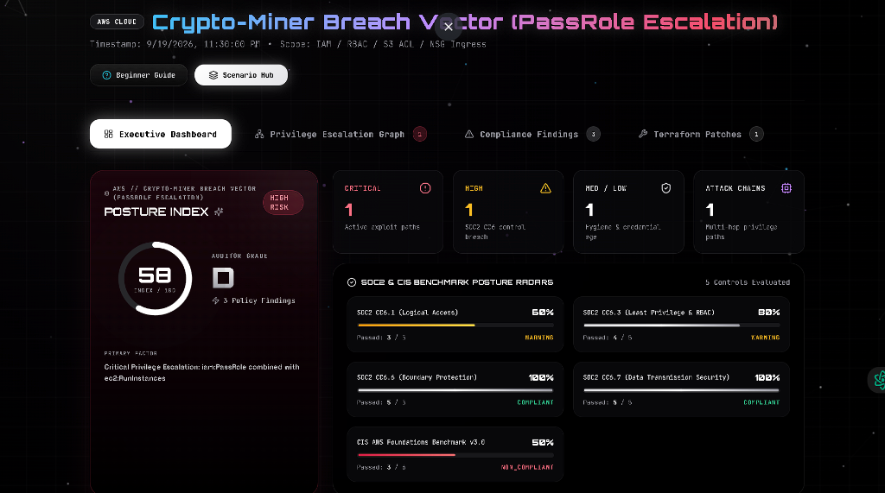
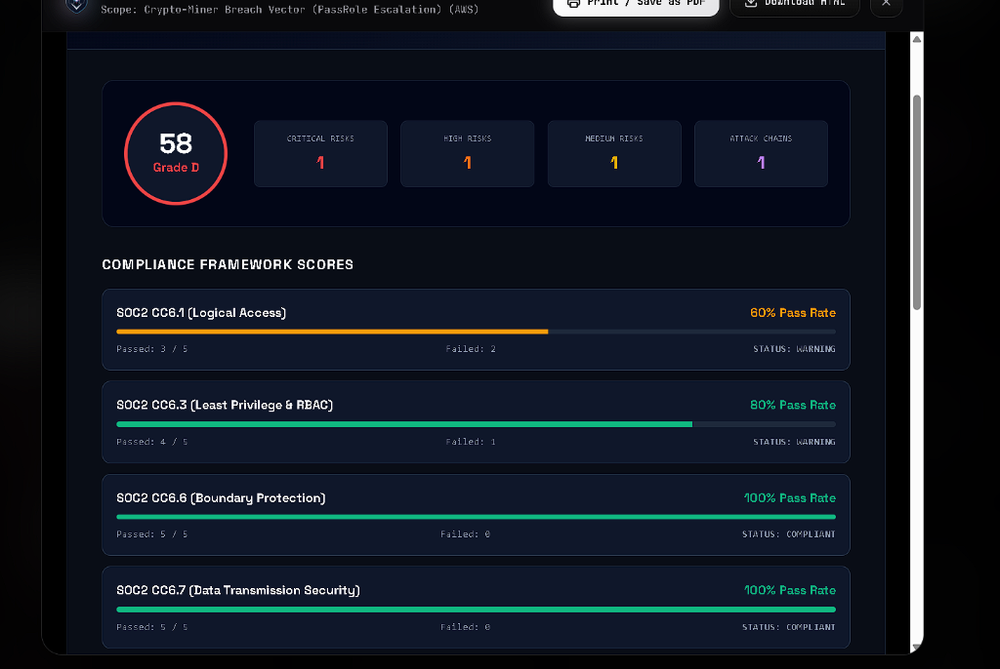
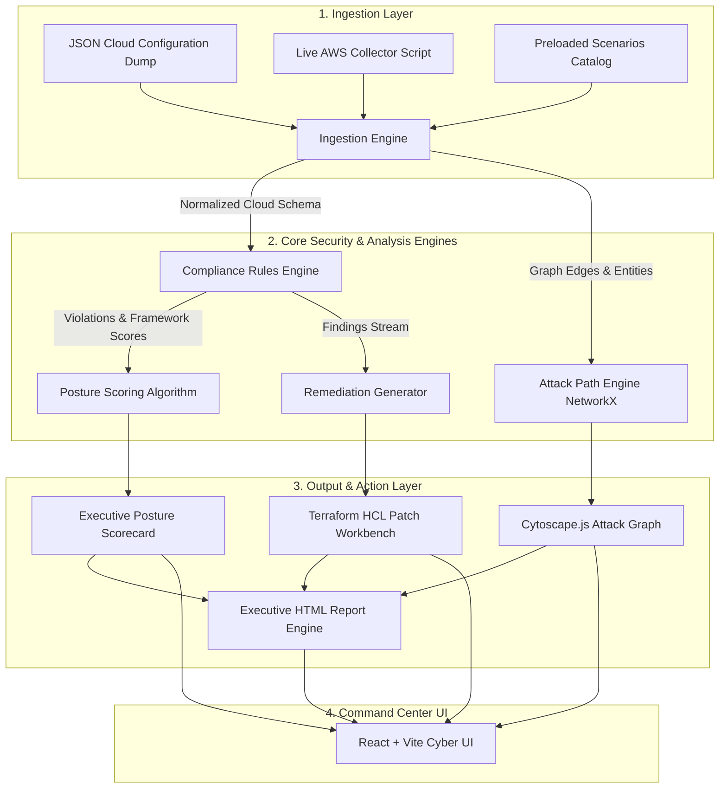

<div align="center">

# 🛡️ AUDITHOUND
### Autonomous Multi-Cloud Security Auditing & Compliance Posture Engine

[](https://www.python.org/)
[](https://fastapi.tiangolo.com/)
[](https://reactjs.org/)
[](https://www.typescriptlang.org/)
[](https://vitejs.dev/)
[](https://tailwindcss.com/)
[](https://js.cytoscape.org/)
[](https://www.cisecurity.org/)

<br />

<p align="center">
  <b>AuditHound</b> is an enterprise-grade autonomous cloud security posture management (CSPM) and compliance auditing platform. It continuously inspects multi-cloud infrastructure configurations (AWS, Azure, Kubernetes), models privilege escalation attack graphs, maps violations to SOC2 Common Criteria and CIS Benchmarks, and automatically generates production-ready, least-privilege Terraform (<code>.tf</code>) remediation patches.
</p>

[Visual Walkthrough](#-end-to-end-audit-walkthrough-input-posture-output--ciso-report) • [Key Features](#-key-features) • [Architecture](#-architecture) • [Live Scenarios](#-mock-environments-catalog) • [Quickstart](#-quickstart-guide) • [CLI Scanner](#-audithound-cli-scanner) • [REST API](#-api-specification) • [Security](#-security--hardening)

</div>

---

## ⚡ Executive Summary

Modern multi-cloud environments suffer from fragmented identity silos, sprawling permission boundaries, and latent privilege escalation paths. Traditional static linters only look at single resources in isolation; they miss the composite identity chains that attackers exploit to take over entire cloud organizations.

**AuditHound** bridges this gap by combining:
1. **Graph-Theoretic Attack Path Analysis** (NetworkX traversal detecting lateral movement and IAM privilege escalation).
2. **Deterministic Compliance Mapping** (SOC2 CC6.1–CC6.8 and CIS AWS/Azure/K8s benchmarks).
3. **Automated Terraform HCL Remediation** (generating immediate drop-in least-privilege patches).
4. **CISO-Ready Executive Reporting** (auditor sign-offs, risk matrices, and exportable HTML/PDF briefs).

---

## 📸 End-to-End Audit Walkthrough: Input, Posture Output & CISO Report

AuditHound delivers an end-to-end autonomous security pipeline from raw cloud configuration ingestion to mathematical attack graph analysis, posture grading, and CISO audit sign-off:

### 1️⃣ Initial Input — Scenario Telemetry & Threat Ingestion
> Ingests multi-cloud configuration dumps (AWS IAM policies, trust relationships, security groups, and storage ACLs) and identifies latent risk boundaries.

<div align="center">
  
  <p><i>Figure 1: Initial Telemetry Ingestion — Scenario <code>04_crypto_miner_breach_vector</code> (PassRole Escalation) loaded with active IAM and network boundaries.</i></p>
</div>

<br/>

### 2️⃣ Engine Output — Posture Index & Attack Path Graph
> Computes deterministic compliance grades (0–100) using weighted penalty algorithms and traverses multi-hop lateral movement chains with NetworkX.

<div align="center">
  
  <p><i>Figure 2: Executive Scorecard Output — Posture Index <b>58 (Auditor Grade D)</b> with 1 Critical Exploit Path, 1 High-Risk Finding, and SOC2/CIS compliance radars.</i></p>
</div>

<br/>

### 3️⃣ Final Output — Executive CISO Compliance Report & Remediation
> Generates comprehensive, auditor-certified CISO briefs with framework score breakdowns, risk matrices, and dynamically synthesized Terraform (<code>.tf</code>) patches.

<div align="center">
  
  <p><i>Figure 3: CISO Executive Report Modal — SOC2 CC6.1 (60%), CC6.3 (80%), CC6.6 (100%), and CC6.7 (100%) pass rates with printable PDF export.</i></p>
</div>

---

```
┌────────────────────────────────────────────────────────────────────────────────────────┐
│                                AUDITHOUND SENTINEL CORE                                │
├────────────────────────┬────────────────────────┬──────────────────────────────────────┤
│ 🛰️ MULTI-CLOUD INGEST  │ 🕸️ ATTACK PATH GRAPH   │ 🛠️ TERRAFORM AUTO-REMEDIATION        │
│ AWS IAM, S3, SGs,      │ NetworkX traversal     │ One-click generation of scoped,      │
│ Azure RBAC, NSGs,      │ detecting PassRole,    │ least-privilege HCL (.tf) patches    │
│ Kubernetes RBAC dumps  │ PolicyVersion & K8s SA │ with side-by-side diff previews.     │
├────────────────────────┼────────────────────────┼──────────────────────────────────────┤
│ 📋 SOC2 & CIS ENGINE   │ 📊 EXECUTIVE SCORECARD │ 📑 AUDITOR SIGNOFF REPORTS           │
│ Real-time compliance   │ Live Posture Score     │ Auditor-ready printable executive    │
│ checks across CC6.1,   │ (0-100), Letter Grade  │ HTML reports with cryptographic      │
│ CC6.3, CC6.6, CIS AWS. │ (A+ to F), Risk Index. │ timestamps and signature fields.     │
└────────────────────────┴────────────────────────┴──────────────────────────────────────┘
```

### 1. Multi-Cloud Ingestion Engine
- Ingests synthetic and live JSON configuration dumps.
- Normalizes disparate schema models across **AWS** (IAM Users, Groups, Roles, Policies, S3 Buckets, Security Groups), **Microsoft Azure** (Role Assignments, Network Security Groups), and **Kubernetes** (`RoleBindings`, `ClusterRoleBindings`, `ServiceAccounts`).
- Includes **10 realistic pre-loaded enterprise scenarios** ranging from Tier-1 hardened banking enclaves to critical crypto-mining and ransomware attack paths.

### 2. Privilege Escalation & Attack Path Analyzer
- Builds directed permission graphs using **NetworkX** and visualizes them on an interactive high-performance **Cytoscape.js** canvas.
- Identifies critical MITRE ATT&CK lateral movement techniques:
  - **PassRole Escalation**: `iam:PassRole` + `ec2:RunInstances` leading to root administrator takeover.
  - **Policy Version Modification**: `iam:CreatePolicyVersion` / `iam:SetDefaultPolicyVersion` self-elevation.
  - **Kubernetes Cluster Takeover**: Unsegmented namespace `ServiceAccount` bound to `cluster-admin`.
  - **Public Data Leakage**: Unauthenticated S3 bucket read ACLs exposing sensitive datasets.
  - **Direct Ingress Exposure**: Open `0.0.0.0/0` security group rules on sensitive ports (SSH 22, RDP 3389, MySQL 3306, Postgres 5432, MSSQL 1433).

### 3. Compliance Rules Matrix
- Evaluates infrastructure against **SOC2 Common Criteria**:
  - `SOC2 CC6.1`: Logical Access Security, Hardware MFA enforcement, Key rotation (<90 days).
  - `SOC2 CC6.3`: Role-Based Access Control, Least-Privilege Scoping, Wildcard elimination.
  - `SOC2 CC6.6`: Boundary Protection, Perimeter Ingress Isolation, Zero-Trust network rules.
  - `SOC2 CC6.7`: Data Transmission & At-Rest Encryption (S3 KMS-CMK enforcement).
  - `SOC2 CC6.8`: Unauthorized Change Defense & S3 Object Versioning.
- Full parity with **CIS AWS Foundations Benchmark v3.0**, **CIS Microsoft Azure Benchmark v2.0**, and **CIS Kubernetes Benchmark v1.8**.

### 4. Terraform Remediation Engine
- Generates executable, syntactically validated Terraform HCL patches for every identified violation.
- Provides side-by-side diff previews with remediation rationale and resource ARNs.
- Offers instant 1-click batch download of all remediations as a consolidated `.tf` bundle (`audithound_remediation_<env>.tf`).

### 5. Executive & Printable Reporting
- Generates auditor-ready HTML reports containing compliance radars, framework scores, finding summaries, and executive sign-off fields.
- Autoescaped template rendering prevents XSS injections.

---

## 📐 Architecture



---

## 📦 Mock Environments Catalog

AuditHound includes 10 pre-loaded cloud scenarios demonstrating real-world cloud architectures:

| ID | Environment Name | Provider | Letter Grade | Risk Level | Attack Vector / Key Violations |
|---|---|---|:---:|:---:|---|
| `01_fintech_prod_banking` | **Fintech Tier-1 Banking** | AWS | **A+ (94%)** | Low | SOC2 CC6.1/6.3 certified, zero wildcard permissions, KMS encryption. |
| `02_aerospace_defense_cloud` | **Aerospace & Defense Enclave** | AWS | **A+ (97%)** | Low | FedRAMP High hardened, strict hardware MFA, zero public ingress. |
| `03_shadow_it_dev_sandbox` | **Shadow IT Dev Sandbox** | AWS | **D (54%)** | Elevated | Open `0.0.0.0/0` SSH/RDP ingress, missing MFA, wildcard S3 access. |
| `04_crypto_miner_breach_vector` | **Crypto-Miner Attack Vector** | AWS | **F (49%)** | Critical | `iam:PassRole` + `ec2:RunInstances` escalation leading to admin role breach. |
| `05_leaky_health_datalake` | **Leaky Health DataLake** | AWS | **F (38%)** | Critical | HIPAA ePHI violation, public S3 read ACLs, unencrypted bucket storage. |
| `06_k8s_cluster_takeover` | **Kubernetes Takeover Vector** | K8s | **F (44%)** | Critical | Default namespace ServiceAccount bound to `cluster-admin`. |
| `07_stale_key_exfiltration` | **Stale Key Exfiltration Risk** | AWS | **D (56%)** | Elevated | Active access keys >400 days old, missing MFA, dormant full-admin rights. |
| `08_multi_cloud_hybrid_transit` | **Multi-Cloud Hybrid Transit** | Hybrid | **F (49%)** | Critical | Azure NSG open on MySQL/Postgres, wildcard cross-account trust. |
| `09_ecommerce_pci_noncompliant` | **E-Commerce Cardholder (CDE)** | AWS | **F (38%)** | Critical | PCI-DSS violation, exposed DB port 3306, unencrypted card exports. |
| `10_ransomware_target_enterprise` | **Ransomware Blast Radius** | AWS | **F (42%)** | Critical | `iam:CreatePolicyVersion` escalation rights, unversioned S3 buckets. |

---

## 🛠️ Quickstart Guide

### System Requirements
- **Python**: 3.12+
- **Node.js**: 18.0+ and npm

### 1. Backend Setup
```bash
cd audithound/backend
python -m venv venv

# Activate virtual environment
# On Windows (PowerShell):
.\venv\Scripts\activate
# On Linux/macOS:
source venv/bin/activate

# Install dependencies
pip install -r requirements.txt

# Run test suite
pytest -v

# Start FastAPI development server
python -m app.main
```
The backend API runs at `http://localhost:8000`.
- **Interactive Swagger Docs**: `http://localhost:8000/docs`
- **ReDoc Documentation**: `http://localhost:8000/redoc`

### 2. Frontend Setup
```bash
cd ../frontend
npm install
npm run build
npm run dev
```
Open your browser at **`http://localhost:3000`** to access the Cyber Command Center dashboard.

---

## 🖥️ AuditHound CLI Scanner

AuditHound includes a standalone command-line scanner (`audithound_cli.py`) for automated CI/CD security pipelines.

```bash
cd audithound
# Scan a custom cloud configuration dump and output a summary table
python backend/audithound_cli.py --file sample_opensource_cloud_dump.json

# Scan and export executive HTML report + Terraform patches
python backend/audithound_cli.py \
  --file sample_opensource_cloud_dump.json \
  --report executive_audit.html \
  --tf-output remediations.tf
```

---

## 📡 Live AWS Cloud Collector

To extract live configurations from an actual AWS account and generate an AuditHound JSON file:

```bash
cd audithound
# Requires boto3 and configured AWS credentials (AWS_PROFILE or environment keys)
python scripts/aws_live_collector.py \
  --profile my-aws-profile \
  --region us-east-1 \
  --output live_aws_audit_dump.json
```

---

## 🔒 Security & Hardening

AuditHound is built with security-first engineering practices:
- **Strict CORS Origin Restriction**: Wildcard origins are disallowed; requests are constrained to trusted origins.
- **Path Traversal Defense**: All environment identifiers are validated against strict regex bounds (`^[a-zA-Z0-9_\-\.]+$`).
- **DoS Memory Protection**: Upload payloads are capped at 5MB with strict streaming byte limits.
- **XSS Autoescaping**: Jinja2 and client-side templates use autoescaping on all dynamic metadata and finding titles.
- **Zero Information Leakage**: Exception messages are sanitized before client delivery; detailed stack traces are logged securely on the backend.

---

## 🧪 Automated Testing

```bash
cd audithound/backend
pytest tests -v
```

---

## 📄 License

This project is licensed under the [Apache License 2.0](../LICENSE).
